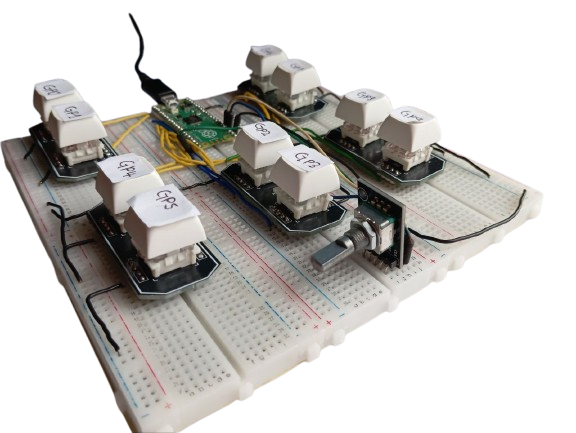

# macro_pad_kb
Designed using the cherry mx switch breakout board, is programmed and tested using the Thonny IDE for seamless development and debugging. Equipped with durable push buttons for enhanced productivity.

